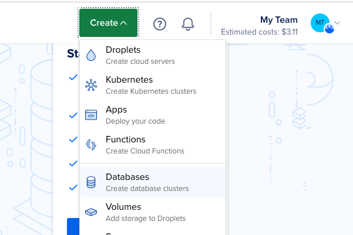
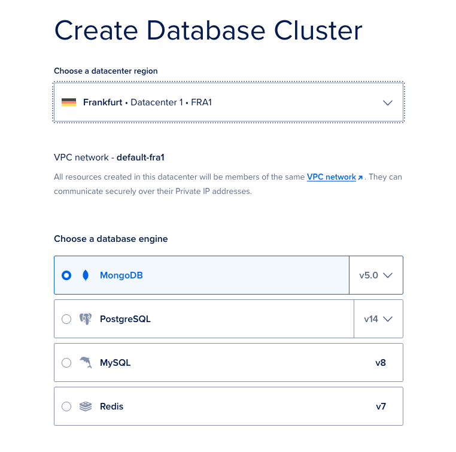
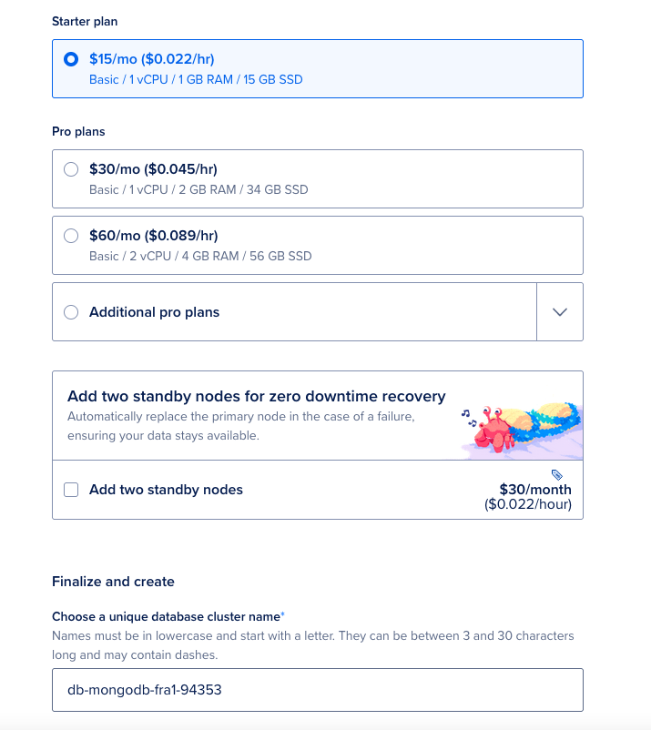
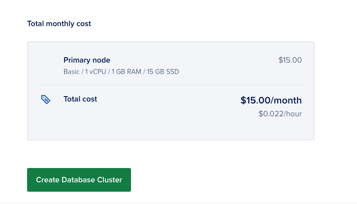
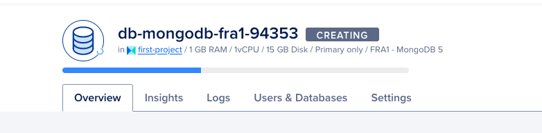
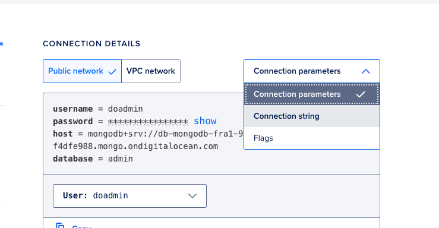
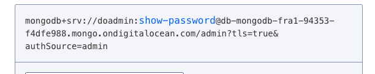
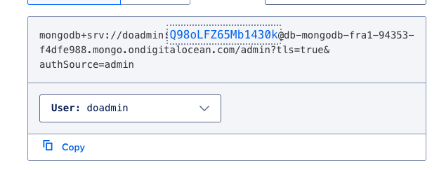

## Set Up a MongoDB Database Cluster

To begin setting up the application, you need to create a database to store the data. In this step, you will create a MongoDB database cluster using the DigitalOcean Control Panel and add a new database to it.

To create a MongoDB database from the DigitalOcean Control Panel, click the Create button in the top right of the screen, then select Databases from the drop-down menu.

On the database creation page, select MongoDB in the Choose a database engine section. 

In the Choose a name field, name the database as you want or remain the existing value.

Leave the rest of the configuration options on their default settings and then click Create a Database Cluster to deploy the cluster. 

This may take several minutes to complete.

Once you’ve created the new database, click the Overview tab and locate the CONNECTION DETAILS section. This section contains your database’s connection credentials.

Next, in the Connection Parameters drop-down menu, click Connection string. The CONNECTION DETAILS section populates with a connection string you can provide to the App to connect to the database cluster. Copy the string using the copy button to connect to the database in the next step.

The connection string contains the placeholder value. If you don’t know the password for your cluster’s admin user, you can reset the password in the cluster’s Users and Databases tab.

*Inspired by https://www.antstack.com/blog/build-a-blog-application-using-digital-ocean-functions/*